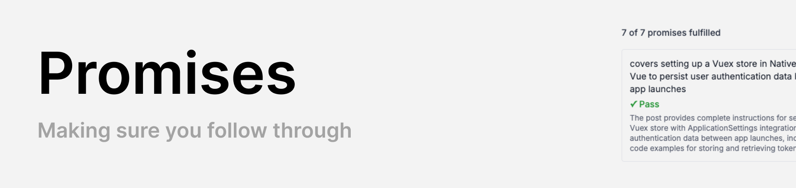
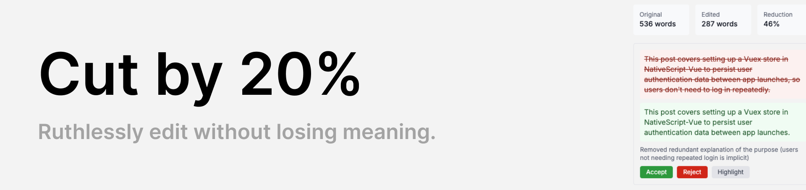

<h1></h1>

Wordsworth is a browser-based writing workbench for people who write technical content. Paste your Markdown into the editor, pick a tool, and get instant feedback on readability, style, and more.

Most tools run entirely in the browser with no account or API key required. AI-powered features (audience assessment, style fixes) are bring-your-own-key -- enter an OpenAI, Anthropic, or Google API key in settings and requests go directly through a lightweight proxy. You can also use [Ollama](https://ollama.com) to run models locally with no API key or cloud account required. Nothing is stored server-side.

## Tools

<h3></h3>

Answers the question: _is this pitched at the right level for my readers?_

Wordsworth calculates three standard readability metrics from your text: Flesch-Kincaid score, Gunning Fog index, and an overall grade level. It also shows word count, sentence count, and estimated reading time.

The grade level is displayed with a color-coded indicator -- green for grade 8 and below, yellow for 9-12, and red for 13+. A plain-English label (e.g. "middle school", "college") accompanies the number so you can quickly judge whether your writing matches your audience.

Below the metrics, you can select a target audience from presets (Senior developers, Junior developers, Non-technical stakeholders, General audience) or write your own custom description. If you have an AI API key configured, an "Assess for audience with AI" button sends your document and audience description to an LLM, which returns a one-paragraph verdict on whether your jargon level, sentence complexity, and assumed knowledge are appropriate. The assessment considers context -- it won't penalise technical terminology when writing for a technical audience.

<h3></h3>

Scans your prose for three categories of style issues:

- **Passive voice** -- flags constructions like "was written" or "is being built" that weaken technical writing.
- **Wordy phrases** -- catches verbose constructions ("in order to", "due to the fact that", "utilize") and suggests concise alternatives.
- **Inconsistencies** -- detects mixed US/UK spelling ("color" vs "colour") and inconsistent terminology ("user" vs "customer" vs "client") within the same document, flagging the minority usage.

Each issue shows the line number, the flagged text, and a suggestion. Clicking an issue highlights the relevant line in the editor. If you have an AI API key configured, you can fix individual issues or all issues at once -- the AI rewrites the affected text and presents a diff for you to review and accept before anything changes.

<h3></h3>

Reveals the pronoun balance in your writing by counting three groups: I/me/my, you/your, and we/us/our. It calculates percentages and produces a tone assessment -- from "strongly reader-focused" to "strongly author-focused" -- so you can see at a glance whether your docs talk _to_ the reader or _at_ them.

All pronoun matches are highlighted inline in the editor with color-coded markers (blue for I-group, green for you-group, amber for we-group), making it easy to spot clusters.

Technical documentation generally benefits from a reader-focused "you" voice. This tool makes the balance visible without you having to count anything.

<h3></h3>

Bulk-shifts all Markdown header levels up or down by one. Promote turns every H2 into H1, every H3 into H2, and so on. Demote does the reverse.

This is useful when embedding content into a larger site where the page title occupies H1, so your document headings need to drop a level. The tool shows a breakdown of how many headers exist at each level (H1-H6), blocks unsafe operations (promoting when an H1 already exists, demoting when an H6 exists), and provides an undo button to revert the last shift.

<h3></h3>

Answers the question: _does your article deliver on what the introduction sets up?_

This AI-powered tool reads through your document and identifies claims or promises made in the opening paragraphs -- things like "this guide will show you how to..." or "by the end you'll understand...". It then checks whether each promise is actually fulfilled in the body and conclusion, returning a verdict of pass, fail, or partial for each one, along with evidence from the text.

The result shows a summary count (e.g. "2 of 3 promises fulfilled") followed by each promise with a color-coded verdict -- green for pass, red for fail, yellow for partial. Requires an AI API key.

<h3></h3>

Answers the question: _can this be shorter without losing anything important?_

This AI-powered tool sends your document to an LLM with a single directive: cut approximately 20% of the word count while preserving technical accuracy and meaning. If you have a target audience configured, the model factors that in when deciding what to trim -- it won't cut context that your readers need.

The result shows original and edited word counts with the reduction percentage, followed by a list of individual edit chunks. Each chunk displays the original text (struck through, red) alongside the condensed replacement (green), with a brief reason for the cut. You review each suggestion independently -- Accept applies the edit to your document immediately, Reject keeps the original, and Highlight scrolls to the relevant passage in the editor. Requires an AI API key.

## Running locally

Most tools (Readability, Style Check, Pronouns, Header Shift) run entirely in the browser with no backend. The AI-powered features (audience assessment, style fixes, promise tracking, cut by 20%) route through a Netlify Functions proxy at `netlify/functions/ai-proxy.mts`, so you need to use the Netlify CLI to run the dev server:

```
npm install
netlify dev
```

This starts both the Vite frontend and the Netlify Functions server. The proxy accepts requests at `/api/ai` and forwards them to your configured AI provider (OpenAI, Anthropic, or Google). API keys are entered in the settings modal and stored in your browser's local storage -- they are sent per-request to the proxy and are never stored server-side.

If you only need the non-AI tools, `npx vite` works fine -- the AI buttons simply won't appear unless you configure a key.

### Using Ollama (local models)

If you'd rather run AI features against a local model instead of a cloud API, you can use [Ollama](https://ollama.com):

1. [Install Ollama](https://ollama.com/download) and pull a model (e.g. `ollama pull llama3.1:8b`).
2. Make sure Ollama is running (`ollama serve` or the desktop app).
3. In Wordsworth's settings modal, click the **Ollama** provider button.
4. Enter the model name as shown by `ollama list` (e.g. `llama3.1:8b`).
5. The base URL defaults to `http://localhost:11434` -- change it if Ollama is running on a different host or port.

No API key is needed. Ollama requests go directly from your browser to the local Ollama server, bypassing the Netlify proxy entirely. Smaller models may produce lower-quality results for complex tasks like promise tracking, but work well for style fixes and audience assessment.

> **Note:** On the hosted version of Wordsworth, Ollama is disabled since it requires a local server. To use Ollama, clone the repo and run locally with `netlify dev`. If you're deploying your own instance, set the `VITE_DISABLE_OLLAMA` environment variable to `true` in your Netlify dashboard to show a "run locally" message instead of the Ollama configuration inputs.
