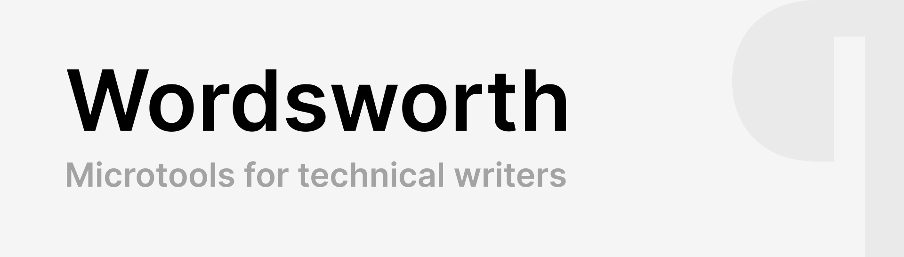
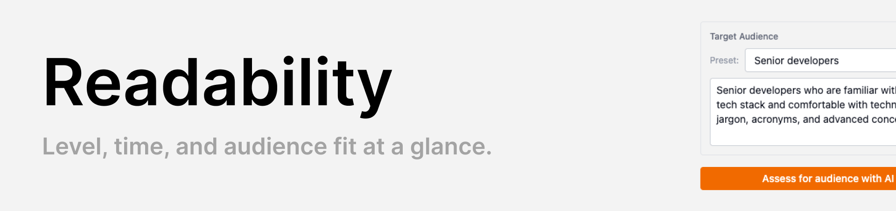
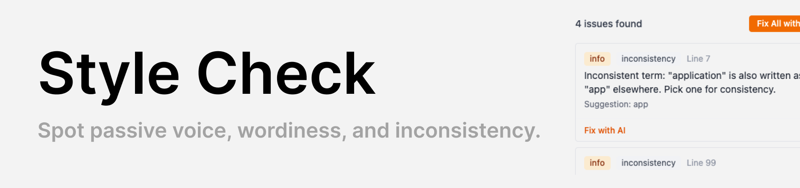
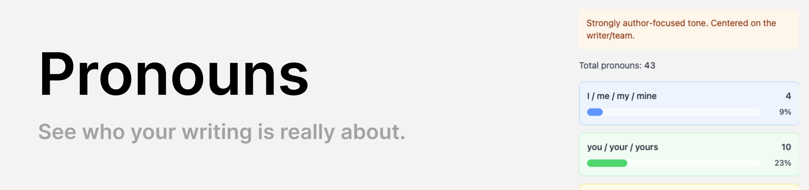
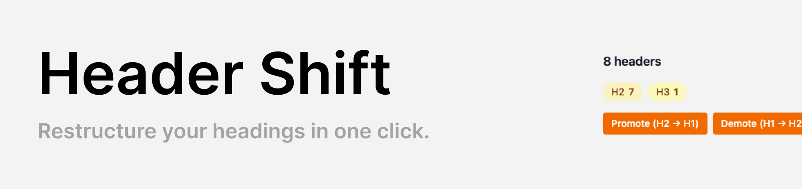

Wordsworth is a browser-based writing workbench for people who write technical content. Paste your Markdown into the editor, pick a tool, and get instant feedback on readability, style, and more.

Most tools run entirely in the browser with no account or API key required. AI-powered features (audience assessment, style fixes) are bring-your-own-key -- enter an OpenAI, Anthropic, or Google API key in settings and requests go directly through a lightweight proxy. Nothing is stored server-side.

## Tools

### Readability

Answers the question: _is this pitched at the right level for my readers?_

Wordsworth calculates three standard readability metrics from your text: Flesch-Kincaid score, Gunning Fog index, and an overall grade level. It also shows word count, sentence count, and estimated reading time.

The grade level is displayed with a color-coded indicator -- green for grade 8 and below, yellow for 9-12, and red for 13+. A plain-English label (e.g. "middle school", "college") accompanies the number so you can quickly judge whether your writing matches your audience.

Below the metrics, you can select a target audience from presets (Senior developers, Junior developers, Non-technical stakeholders, General audience) or write your own custom description. If you have an AI API key configured, an "Assess for audience with AI" button sends your document and audience description to an LLM, which returns a one-paragraph verdict on whether your jargon level, sentence complexity, and assumed knowledge are appropriate. The assessment considers context -- it won't penalise technical terminology when writing for a technical audience.



### Style Check

Scans your prose for three categories of style issues:

- **Passive voice** -- flags constructions like "was written" or "is being built" that weaken technical writing.
- **Wordy phrases** -- catches verbose constructions ("in order to", "due to the fact that", "utilize") and suggests concise alternatives.
- **Inconsistencies** -- detects mixed US/UK spelling ("color" vs "colour") and inconsistent terminology ("user" vs "customer" vs "client") within the same document, flagging the minority usage.

Each issue shows the line number, the flagged text, and a suggestion. Clicking an issue highlights the relevant line in the editor. If you have an AI API key configured, you can fix individual issues or all issues at once -- the AI rewrites the affected text and presents a diff for you to review and accept before anything changes.



### Pronouns

Reveals the pronoun balance in your writing by counting three groups: I/me/my, you/your, and we/us/our. It calculates percentages and produces a tone assessment -- from "strongly reader-focused" to "strongly author-focused" -- so you can see at a glance whether your docs talk _to_ the reader or _at_ them.

All pronoun matches are highlighted inline in the editor with color-coded markers (blue for I-group, green for you-group, amber for we-group), making it easy to spot clusters.

Technical documentation generally benefits from a reader-focused "you" voice. This tool makes the balance visible without you having to count anything.



### Header Shift

Bulk-shifts all Markdown header levels up or down by one. Promote turns every H2 into H1, every H3 into H2, and so on. Demote does the reverse.

This is useful when embedding content into a larger site where the page title occupies H1, so your document headings need to drop a level. The tool shows a breakdown of how many headers exist at each level (H1-H6), blocks unsafe operations (promoting when an H1 already exists, demoting when an H6 exists), and provides an undo button to revert the last shift.



## Running locally

Most tools (Readability, Style Check, Pronouns, Header Shift) run entirely in the browser with no backend. The AI-powered features (audience assessment, style fixes) route through a Netlify Functions proxy at `netlify/functions/ai-proxy.mts`, so you need to use the Netlify CLI to run the dev server:

```
npm install
netlify dev
```

This starts both the Vite frontend and the Netlify Functions server. The proxy accepts requests at `/api/ai` and forwards them to your configured AI provider (OpenAI, Anthropic, or Google). API keys are entered in the settings modal and stored in your browser's local storage -- they are sent per-request to the proxy and are never stored server-side.

If you only need the non-AI tools, `npx vite` works fine -- the AI buttons simply won't appear unless you configure a key.
