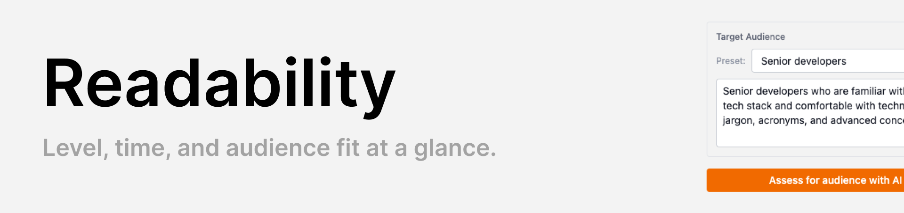
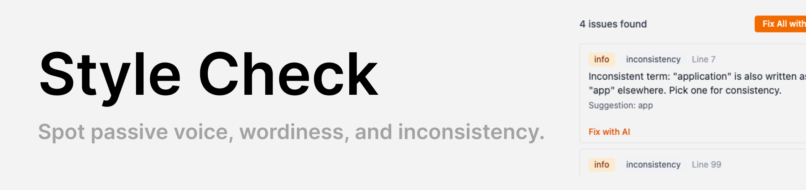
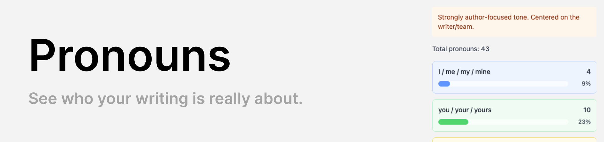
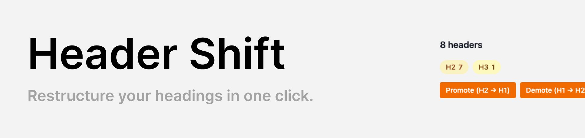
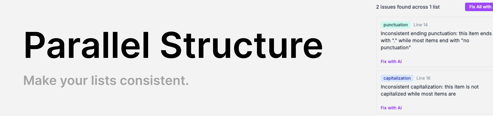
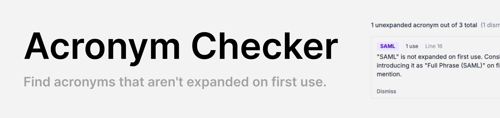
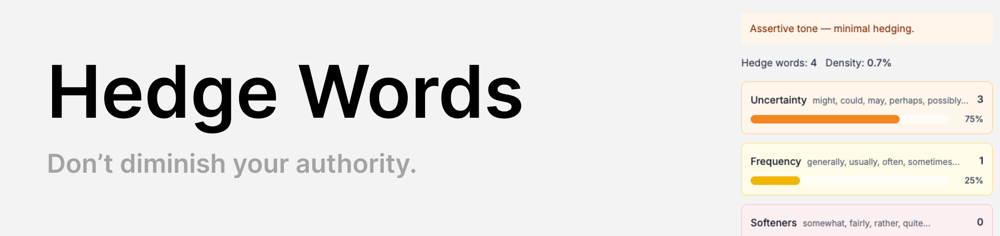
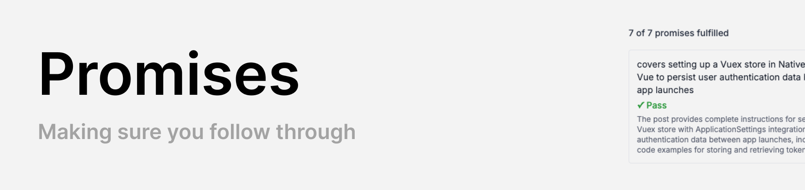
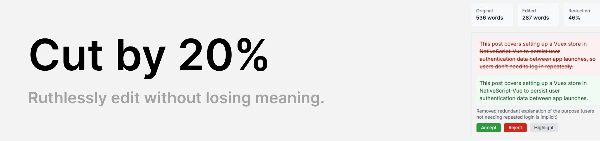

<h1></h1>

> [!TIP]
> **Use as an agent skill:** `npx skills add phazonoverload/wordsworth`

Wordsworth is a set of microtools for technical writers. It analyzes Markdown documents for readability, style, tone, and structure — flagging issues, suggesting improvements, and surfacing patterns that need attention.

All diagnostics run locally with no account or API key required. AI-powered features (audience assessment, style fixes, parallel structure fixes, promise tracking, cut by 20%) require an OpenAI, Anthropic, or Google API key.

## Tools

<h3></h3>

Answers the question: _is this pitched at the right level for my readers?_

Calculates three standard readability metrics — Flesch-Kincaid Reading Ease, Gunning Fog Index, and an overall grade level — plus word count, sentence count, and estimated reading time. A plain-English label (e.g. "middle school", "college") makes the grade level immediately interpretable.

<h3></h3>

Scans prose for three categories of style issues:

- **Passive voice** -- flags constructions like "was written" or "is being built" that weaken technical writing.
- **Wordy phrases** -- catches verbose constructions ("in order to", "due to the fact that", "utilize") and suggests concise alternatives.
- **Inconsistencies** -- detects mixed US/UK spelling and inconsistent terminology within the same document, flagging the minority usage.

Each issue reports the line number, the flagged text, and a suggested fix. AI-powered fixes present a diff for review before applying any changes.

<h3></h3>

Counts personal pronouns across three groups (I/me/my, you/your, we/us/our) and produces a tone assessment — from "strongly reader-focused" to "strongly author-focused". Technical documentation generally benefits from a reader-focused "you" voice.

<h3></h3>

Bulk-shifts all Markdown header levels up or down by one. Useful when embedding content into a larger site where the page title occupies H1. Blocks unsafe operations (promoting when an H1 already exists, demoting when an H6 exists).

<h3></h3>

Answers the question: _are my bullet lists grammatically consistent?_

Classifies each Markdown list item by grammatical opening (imperative verb, gerund, infinitive, noun phrase, or full sentence) and tracks capitalization and punctuation patterns. Flags outliers that break the list's dominant pattern. AI-powered fixes rewrite inconsistent items to match the dominant pattern.

Code blocks are excluded from analysis so fenced examples don't produce false positives.

<h3></h3>

Answers the question: _did I introduce every acronym before using it?_

Finds sequences of two or more uppercase letters and checks whether each one is expanded on first use. Three expansion patterns are recognized: parenthetical definition ("Full Phrase (ACR)"), reverse parenthetical ("ACR (Full Phrase)"), and inline "or" definition ("ACR, or Full Phrase"). Common abbreviations (OK, US, AM/PM, ID) are skipped automatically. Code blocks are excluded.

<h3></h3>

Answers the question: _is my writing too tentative or wishy-washy?_

Scans for hedging language across three groups: **uncertainty hedges** (might, could, may, perhaps, possibly, conceivably, presumably), **frequency hedges** (generally, usually, often, sometimes, occasionally, typically, normally, frequently, rarely, seldom), and **softeners** (somewhat, fairly, rather, quite, slightly, relatively, arguably, practically, essentially, basically, virtually). Reports an overall tone assessment based on hedge density.

Code blocks are excluded from analysis.

<h3></h3>

Answers the question: _does your article deliver on what the introduction sets up?_

AI-powered: reads the introduction to identify promises and forward-looking claims, then checks whether each promise is fulfilled in the body and conclusion. Each promise receives a pass, fail, or partial verdict with supporting evidence.

<h3></h3>

Answers the question: _can this be shorter without losing anything important?_

AI-powered: sends the document to an LLM with the directive to cut approximately 20% of the word count while preserving technical accuracy and meaning. If a target audience is configured, the model factors that in when deciding what to trim. Presents individual edit suggestions with original text crossed out alongside the condensed replacement.
